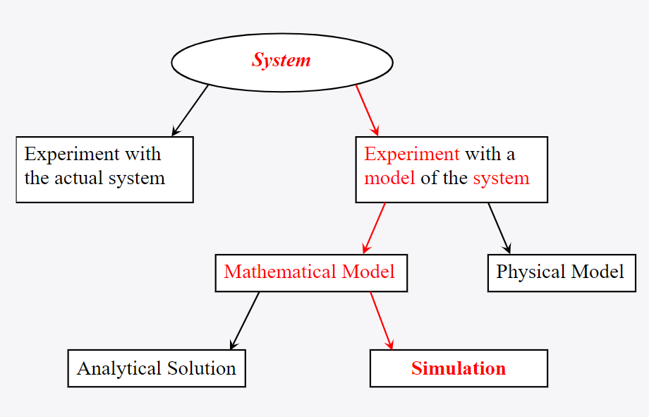

## Model theory 1: What is a Model?

Almost all of the sciences use models. These are simplified representations of reality, where we aim to keep all components required to answer our questions. Models are thus useful when you are dealing with systems that you cannot understand directly, and that are difficult to perform experiments on directly. This means that for any model (not just ABMs), we are always making an approximation of reality. Or, as George Box put it:

> All models are wrong, but some are useful.

So, we want to build _useful_ models. But what defines useful? This very much depends on your goals. In science, the main goal is typically **explaining** some complex process. In business, models are more often used to **predict** or **forecast**. Another application can be **didactical**, when we clearly know a model is too simplistic for proper understanding, but it is still useful for teach about the rough dynamics in a system. So, if our model performs our desired task well, it is useful!

In this track, we will mainly be looking at models that explain. Below you can find an overview of the ways in which different systems are studied, where we will take the 'red' path. Here, the term 'mathematical model' can better be described as a 'computational model' as we will not be doing maths, but we will do a lot of programming!

*Figure: ways to study a system, taken from the reader of the UvA course 'Introduction to Computational Science.'*

As can be seen in the figure, our main tool of analysis will be *simulation*. This simply means running our model many times and seeing what results it produces. This is often required when our model becomes very complex and cannot be solved *analytically* anymore (meaning we can derive the outcome mathematically with 'pen and paper').

So, which components should be included in our model? As Albert Einstein said: *"Make everything as simple as possible, but no simpler"*. This principle is also known as *Occam's razor*, which states that you should always choose the simplest model that explains the phenomena you are interested in adequately.

So, it is *very* important we keep our research question in mind when defining our model. Keeping a clear goal in mind will ensure we include all components that we really need, and no unnecessary other components that only add noise to our results. In the coming exercises, we will explore this idea more, and it will definitely be very important when you write your proposal!

### Aknowledgements

Thanks to Mike Lees and his slides for the UvA course *Introduction to Computational Science*.