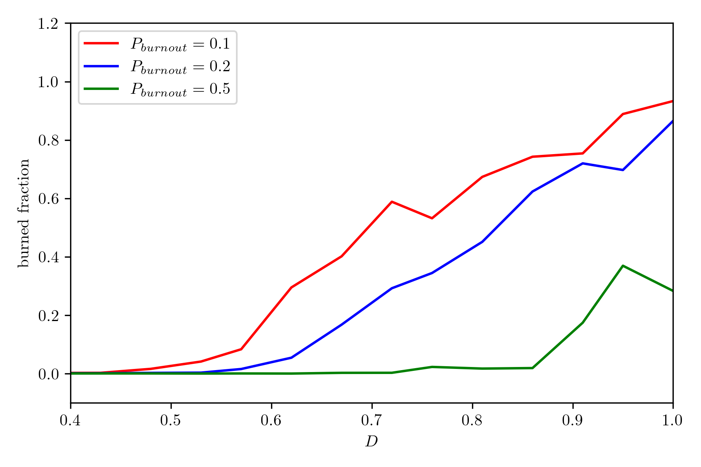
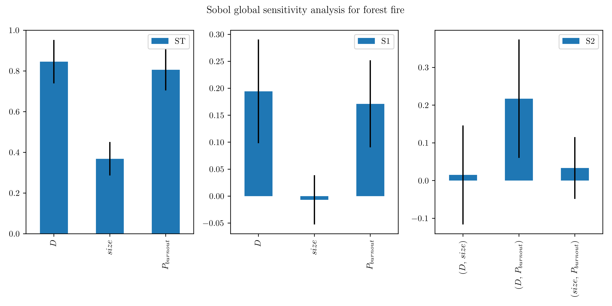

## Model Theory 3: Calibration and Sensitivity Analysis

We have seen what a useful model should contain, and how to conduct an experiment. We will now look into a bit more advanced topics. This concern how we can interpret the results of our experiments. Do they really represent reality? Does it really teach us something about the real world? Trying to answer these questions can get very technical very quickly, and we will only touch upon the very basics. However, even with these basics you will be able to get a much deeper insight in your model!

### Calibration

Your model likely has a lot of parameters for which you need to choose a value. This is done in a process called **calibration**, and it is very important to really make your model act as you expect. As you will see, apart from the 'structure' of the model that you defined in your code, the parameter values you choose also have large impact on the behavior of your model. We thus want to set these values such that the 'standard behavior' of the model looks like what you would expect in the real world.

 Of course, what constitutes 'standard behavior' depends both on your system and the research question you are trying to answer. For instance, if you have an ecological model, you probably want to set your parameter values such that you reach a stable (oscillating) population for both the predators and preys. If your model already acts unexpectedly when you have not started your experiment, it will be diffucult to interpret the experimental results.

Calibration can be very difficult, because our models typically have quite a few parameters. Lets say we have $n$ parameters $\phi_1, \phi_2, \dots, \phi_n$, and each of these parameters can take values between $\phi^{\min}_i$ and $\phi^{\max}_i$. Lets say we chop this range in $M$ discrete values, then then this gives us $M^n$ different combinations! Can you figure out how the number of simulations scales for $M$ and $n$? 

Luckily, we do not need to run each combination. We probably can already say of quite a few combinations that they do not make any sense. Furthermore, maybe some of our parameters can be fixed based on pre-existing knowledge. This greatly reduces our problem, but we are likely still left with parameters we have to set ourselves. 

There is a huge body of highly technical literature on this topic. However, luckily  for us, the best approach for us will be simple **trial-and-error**. We change the parameter values, see how the system reacts, and further change our parameter values based on the previous results until we have satisfying outcomes. The model will never be perfect (as we already established before), but we should at least try to get very close!

### Sensitivity Analysis

The process described above can be quite tedious. This is certainly the case if your model is very sensitive to (some of) the parameter values, because a small shift may cause a huge difference, and you will have to try a lot of combinations. This is why we want to apply **sensitivity analysis** to our model to estimate how sensitive it is to different parameter values. 

For this, we select our most important parameters and let them vary over some range. Then, we see how the model reacts to these variations. If the model outputs we are interested in vary a lot when we change a parameter, we say our model is very sensitive to this parameter. This means we will have to pay more attention to it when calibrating our model. Also, if our model barely reacts to a parameter, we just set it equal to a reasonable value and reduce our calibration problem.

For this project, we will apply the simplest form of sensitivity analysis: One Factor At a Time (**OFAT**). As the name suggests, here we simply fix all but one parameters to a value we think is reasonable. Then, we let the other parameter change over a range, and then we see how shifting this parameter affects the output. The nice thing about this method is that it is practically the same procedure as we used for our previous experiments!

Below you can see an example of an OFAT analysis for the forest fire model. The density $D$, probability of burnout $P_{burnout}$ and the size of the grid were all varied over a range. Then our variable of interest, the fraction of trees burned, is plotted. The plot shows both the mean burned fraction with the standard deviation, and the median burned fraction. The mean and median act similarly, but their differences tell us a lot about our system. What can you conclude about our system, based on this plot? Which parameters do you think are important? And how does each parameter affect the model output?

### EXTRA

The sensitivity analysis procedure described above is hardly used in real research. This is because OFAT is too simplistic for most nonlinear models. To illustrate this, lets say we again have our $n$ parameter values $\phi_1, \phi_2, \dots, \phi_n$, and want to test the sensitivity of parameter $\phi_i$. We thus want to test how big the impact of $\phi_i$ is on our output. However, the size of this direct impact is influenced by the values of the other fixed parameters $\phi_j, j\ne i$! 

Lets look at an example of the forest fire model. Below you can find the mean burned fraction computed over a range of $D$, as we also showed in the figure above. However, we now initialize the model with a different value of $P_{burnout}$. We can see that the extent to which $D$ affects the burned fraction is changed drastically! The effect of $D$ is much smaller when $P_{burnout}$ is larger. This means the variables $D$ and $P_{burnout}$ _interact_ with each other.

We now get into the territory of more advanced methods. Remember that using an advanced method is **not required** and if you do not use it this **does not** lower your grade. Only if you are interested in exploring this methodological side further, it may be interesting for you to implement a more advanced method. But only do this when all the other components of your model are done.

More advanced methods aim at Global Sensitivity Analysis (GSA). Here, we are not only interested in first-order effects (the direct effect of changing $\phi_i$ on our variable of interest), but also in higher-order effects (the effects a parameter has _through the other parameters_). An often-used method is the variance-based Sobol method [1]. This method _decomposes_ the variance of a model's output. For this, we vary our parameter values, run our model, and then estimate how much of the changes in the model's output are caused by changes in the model's input.

Below, you can find the output of Sobol analysis on our forest fire model. We have three variables: $ST$ (total sensitivity), $S1$ (sensitivity of the first order) and $S2$ (sensitivity of the second order). From the second plot we can see both $D$ and $P_{burnout}$ have a high **Sobol index**. This means their direct (or first-order) impact is large. The black line shows the 95% confidence interval, which is above zero. This means we can say with 95% certainty that $D$ and $P_{burnout}$ have a first-order effect. In the second plot we see that the combination $(D, P_{burnout})$ has a large effect. This means $D$ and $P_{burnout}$ have an interaction effect, as we already saw above. 

Sobol sensitivity analysis thus gives a more complete overview of the effect our parameters have. A nice package for Sobol sensitivity analysis is [SALib](https://salib.readthedocs.io/en/latest/index.html). If you follow their basic tutorial, you can implement Sobol analysis in only a few lines of code! Be aware that this method requires quite a few simulation runs (for instance, the results above are based on 1024 simulation runs). While this is still doable for the relatively small forest fire model, it may take a long time for a more complex model. Therefore, always make sure you save your simulation results once they are done, because you do not want to wait hours for nothing!

[[1]](https://www.sciencedirect.com/science/article/abs/pii/S0378475400002706?via%3Dihub) Sobol, I. M. (2001). Global sensitivity indices for nonlinear mathematical models and their Monte Carlo estimates. Mathematics and computers in simulation, 55(1-3), 271-280.