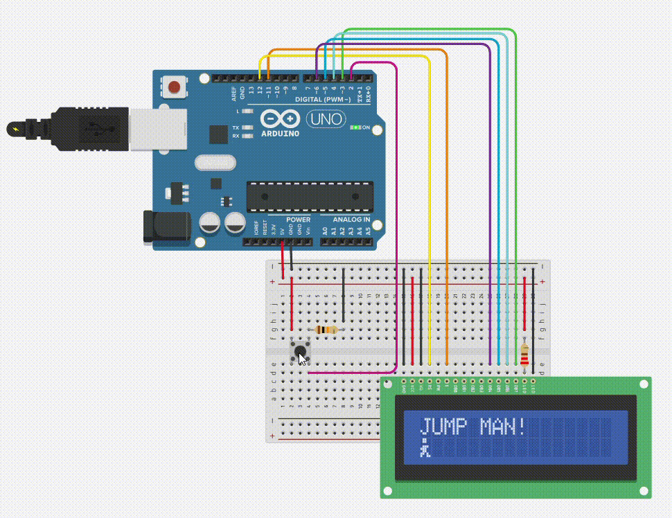
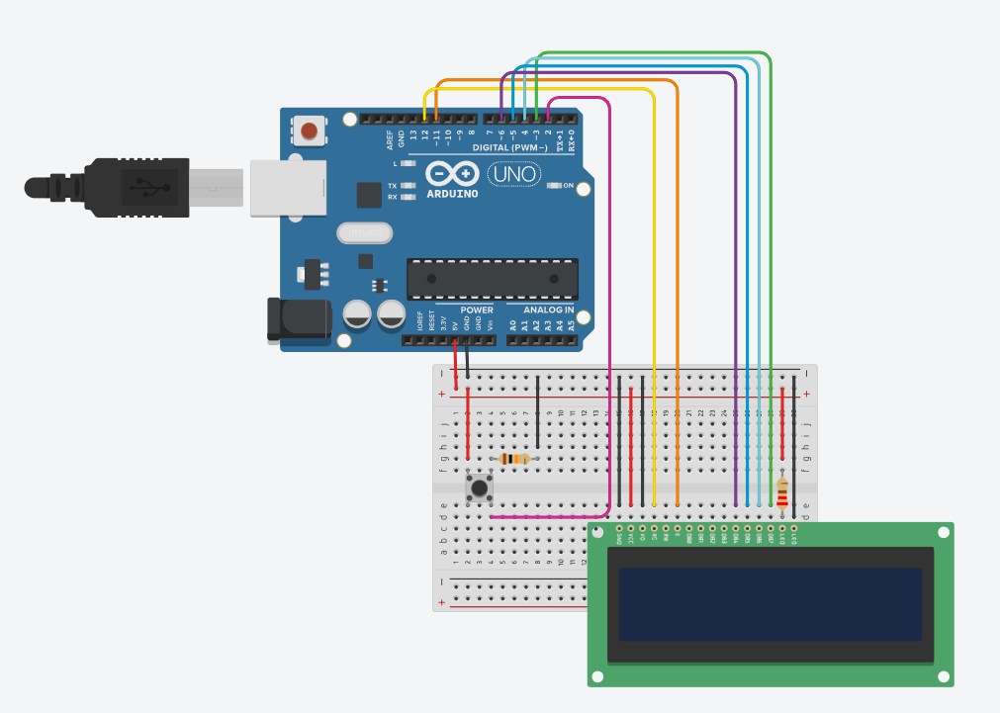
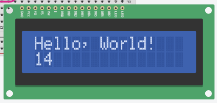
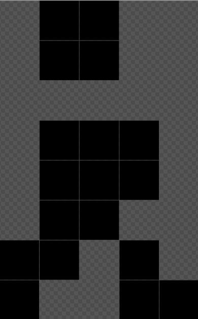
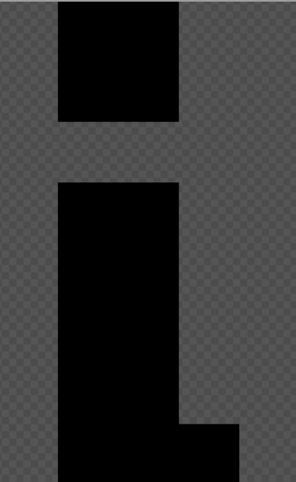
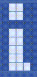
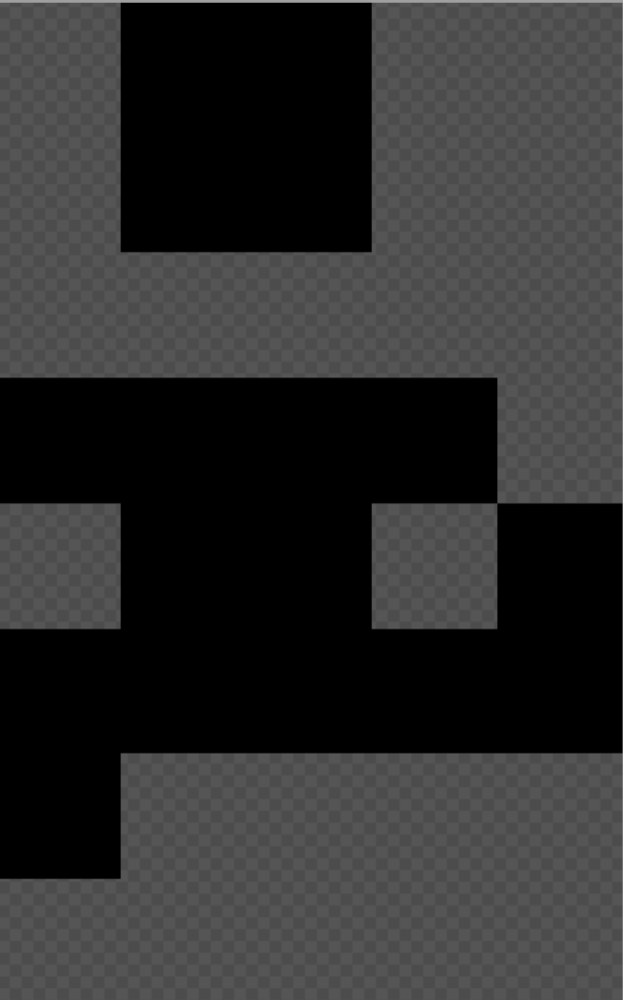

# Jumpman LCD Game!

In this project we will aim to create an interactive game using an Arduino and an LCD screen. In this simple platform game the player controls a hero where he tries to avoid as many obstacles as possible. The player can use to make the hero jump by using a physical button. The LCD screen will display the game environment and provide feedback to the player.

The game will roughly look as follow:

## Circuit

As this project is more focused on the programming aspect the full circuit will be provided. You will need the following components:

| Quantity | Name|
|:--:|:--|
| 1 | Arduino Uno |
| 1 | Breadboard |
| 1 | 16x2 LCD screen |
| 1 | Pushbutton |
| 1 | 220Ω resistor |
| 1 |10kΩ resistor |

These will need to be connected as follow:

## Hello World!

Let's first start by creating a simple hello world example so we can ensure that we can control the screen and the physical button. In this sketch we want to print the message "Hello World!" to the LCD screen on the top row and show the amount of seconds that have passed since the program started on the bottom row.

Firstly let's import the [LiquidCrystal](https://docs.arduino.cc/libraries/liquidcrystal/) library which we will be using to control the LCD:

    #include <LiquidCrystal.h>

Then we need to initialise the library

    // initialize the library by associating any needed LCD interface pin

    // with the arduino pin number it is connected to

    const int rs = 12, en = 11, d4 = 6, d5 = 5, d6 = 4, d7 = 3, btn = 2;

    LiquidCrystal lcd(rs, en, d4, d5, d6, d7);

In the setup method we will need to define the pinMode for our button and setup the library by telling it how many columns and rows the LCD has. We can then print out the sentence: "Hello, World!".

    void setup() {

          pinMode(btn, INPUT);

          lcd.begin(16, 2);

          lcd.print("Hello, World!");

    }

The last thing that is left is to display is a counter with the seconds since the Arduino started. For this we can use the [millis](https://docs.arduino.cc/language-reference/en/functions/time/millis/) method which returns the amount milliseconds since the start of this program.

    void loop() {

          // this moves the cursor to column 0, row 1 so that we print in the correct position

          lcd.setCursor(0, 1);

          // print out the amount of milliseconds

          lcd.print(millis());

    }

> Task: you might have noticed that it is not displaying the time in seconds. Fix this so that we display it in seconds.

> Task: restart the timer at the press of the push button. Refresher on push buttons can be found [here](https://docs.arduino.cc/built-in-examples/digital/Button/).

Now that we have basic control of all physical elements. Let's get started with building the game.

# Game concept

The game will be a classic "Avoid the Obstacles" style game. The player controls a character on the screen, and the goal is to navigate the character to avoid obstacles that appear on the display. The player scores points for each successful obstacle avoided, and the game continues until the player collides with an obstacle.

Before we start building the final game we will make several small projects. These projects aim to demonstrate specific elements of the game in isolation. These projects are as follow:

- **Running Man**: Display a character and make it appear like it's running

- **Jumping Man**: Make the character jump and move between tiles.

- **Obstacle Generation**: Generate obstacles and move them across the screen

## Terminologies

Firstly, let's list several terms that will be used henceforth:
- **screen**: this represents the full LCD screen construted of 16x2 tiles
- **tile**: this represents a single block of 5x8 pixels on the LCD screen which can contain a character
- **character**: this represents a drawing of pixels that can fill up a single tile
- **hero**: this is the controlable character in our game that we control also known as Bob
- **obstacle**: this is an uncontrolable character that the hero has to avoid colliding with
- **frame**: this represents the state of the LCD screen at a moment in time
- **animation**: these are a series of characters across multiple frames

## Features

**Character Animation:** Implement a simple character animation to make the game visually appealing. The character can jump, based on the player's input, to avoid objects.

**Obstacle Generation:** Generate obstacles at random intervals on the screen. The obstacles should move from right to left, and the player must maneuver the character to avoid collisions.

**Score Display:** Use the LCD screen to display the player's score in real-time. Update the score every time an obstacle is successfully avoided.

**Game Over Screen:** When the player collides with an obstacle, display a "Game Over" message on the LCD screen along with the final score. Allow the player to restart the game by pressing the button.

## Running man

The first thing to note is that the LCD screen is a 16x2 tile display (16 columns and 2 rows). Each tile of this display is 5x8 pixels. Each pixel that we want illuminated we give it the value 1 and if we want that pixel to be off we set it to 0.

For the running animation we will use the following two characters which are represented in our code in an 5x8 byte array.

**Run 1**

    byte run1[8] = {

           B01100,

           B01100,

           B00000,

           B01110,

           B11100,

           B01100,

           B11010,

           B10011

    };

**Run 2**

    byte run2[8] = {

           B01100,

           B01100,

           B00000,

           B01100,

           B01100,

           B01100,

           B01100,

           B01110

    };

Combining these two characters we can generate the following running animation

> All animation sprites for the project are provided, but feel free to create your animations using apps like [piskelapp](https://www.piskelapp.com/). Just make sure you set the correct pixel settings and be careful spending too much time on this.

Similar to before let's start our code by adding the library, define the pins for the lcd, the button pin and setup the lcd library.

    #include <LiquidCrystal.h>

    const int rs = 12, en = 11, d4 = 6, d5 = 5, d6 = 4, d7 = 3, btn = 2;
    LiquidCrystal lcd(rs, en, d4, d5, d6, d7);

Following this we add the two characters we defined above. Add the *run1* and the *run2* to your code. We can then store these characters using the [createChar](https://docs.arduino.cc/libraries/liquidcrystal/) method (scroll down on the page for more information).

    void setup() {

    	pinMode(btn, INPUT);  

    	lcd.createChar(0, run1); // store the first character of running to position 0
    	lcd.createChar(1, run2); // store the second character of running to position 1
    	lcd.begin(16, 2);
    }

We can then use `write(byte(position))` to display the character we have created in the setup method.

    void loop() {

    	lcd.setCursor(0,1); // we reset the cursor to the position we want to print our character
    	lcd.write(byte(0)); // this prints out the first character we stored

    	delay(100);

    	lcd.setCursor(0,1); // we reset the cursor to the position we want to print our character
    	lcd.write(byte(1)); // this prints out the first character we stored

    	delay(100);

    }

> Task: Make the hero run faster and slower

> Task: Make the hero run across the screen from left to right and then back to the beginning. Make sure you clear the previous position the character was on.

## Jumping Man

The next step of is to animate the jumping of our character. For this we will want to use the following two characters.

**Jump 1**

    byte jump1[] = {
           B01100,
           B01100,
           B00000,
           B11110,
           B01101,
           B11111,
           B10000,
           B00000
    };

**Jump 2**

[Image]

    byte jump2[] = {
           B11110,
           B01101,
           B11111,
           B10000,
           B00000,
           B00000,
           B00000,
           B00000
    };

The jumping animation follows the following steps:

- Character at the bottom row getting ready to jump - character jump1 stored at position 2

- Character at the bottom row half way though the jump - character jump2 stored at position 3

- Character at the top row for 4 instances - character run1 stored at position 0

- Character at the bottom row half way down the jump - character jump2 stored at position 3

- Character at the bottom row about to land - character jump1 stored at position 2

After the jump animation we can continue back with the running animation. We can define this, and the running, animation as follow (More information on **#define** can be found [here](https://docs.arduino.cc/language-reference/en/structure/further-syntax/define/)):

    #include <LiquidCrystal.h>

    // CHARACTER NAME to stored characters
    #define SPRITE_RUN1 0
    #define SPRITE_RUN2 1

    // CHARACTER NAME to stored characters
    #define SPRITE_JUMP1 2  // starting a jump
    #define SPRITE_JUMP2 3  // half-way up
    #define SPRITE_JUMP3 0  // Jump is on upper row
    #define SPRITE_JUMP4 0  // Jump is on upper row
    #define SPRITE_JUMP5 0  // Jump is on upper row
    #define SPRITE_JUMP6 0  // Jump is on upper row
    #define SPRITE_JUMP7 3  // half-way down
    #define SPRITE_JUMP8 2  // about to land

    int running[] = {
    	SPRITE_RUN1,
    	SPRITE_RUN2
    };  

    int jumping[] = {
    	SPRITE_JUMP1,
    	SPRITE_JUMP2,
    	SPRITE_JUMP3,
    	SPRITE_JUMP4,
    	SPRITE_JUMP5,
    	SPRITE_JUMP6,
    	SPRITE_JUMP7,
    	SPRITE_JUMP8,
    };

Following this we will need to add the arrays for the *run1*, *run2*, *jump1*, *jump2* and setup the pins for the library. Once that's all done we can 'store' the characters as follow:

    void setup() {
    	pinMode(btn, INPUT);	  

    	lcd.createChar(0, run1); // store the first frame of running to position 0
    	lcd.createChar(1, run2); // store the second frame of running to position 1

    	lcd.createChar(2, jump1); // store the first frame of jumping to position 2
    	lcd.createChar(3, jump2); // store the second frame of jumping to position 3

    	lcd.begin(16, 2);
    }

To be able to animate the hero jumping we can iterate through all elements in the jumping array. For the first and last two characters we want to draw them on the bottom row. Otherwise we want to draw it on the top row. This can be achieved as follow

    void loop() {
    	animateJumping();
    }

    void animateJumping() {
    	for (int i = 0; i < sizeof(jumping) / sizeof(int); i++) {
    		// check if the hero should be drawn on the bottom row or top row
    		bool isOnBottom = i <= 1 || i >= 6;

    		// call the draw method
    		drawHero(isOnBottom, jumping[i], 200);
    	}   
    }  

    // method to draw a specific character on top or bottom row with a delay

    void drawHero(bool isOnBottom, int frame, int dl) {
    	// clear the position the hero is not on

    	lcd.setCursor(0, isOnBottom ? 0 : 1);
    	lcd.print(' ');

    	// draw our hero in the correct frame
    	lcd.setCursor(0, isOnBottom ? 1 : 0);
    	lcd.write(byte(frame));

    	// set delay
    	delay(dl);
    }

If you run this code, you will see the character jumping up and down. Adding the line `drawHero(true, 0, 1000);` to the beginning of your loop method will improve how it visually looks.

Combining these two characters we can generate the following jumping animation

This method has a big problem that it will draw out the full animation of the jumping before doing anything else. This means later on we can't progress the obstacles and therefore never jump over them. Every iteration of the for loop we will need to progress the animation by one frame. To do that we will need to make the following changes

    void loop() {
    	\\ check wich character we are supposed to be drawing
    	\\ check which row this character is on
    	drawHero(..., ..., 200);
    }  

    // method to draw a specific character on top or bottom row with a delay
    void drawHero(bool isOnBottom, int frame, int dl) {

    	// clear the position the hero is not on
    	lcd.setCursor(0, isOnBottom ? 0 : 1);
    	lcd.print(' ');

    	// draw our hero in the correct frame
    	lcd.setCursor(0, isOnBottom ? 1 : 0);
    	lcd.write(byte(frame));

    	// set delay
    	delay(dl);
    }

> Task: alter the code in the loop method (and perhaps elsewhere) to be able to progress the jumping animation one character per frame (loop).

> Task: Only start jumping once the jump button is pressed. Make sure if you press the button twice in a row that you don't reset the animation or end up in an invalid state.

> Challenge: can you have the hero jump forward instead of just upwards?

## Obstacle Generation

For this program we will want create the obstacles that the hero has to avoid and move them across the screen. For this we will need to be able to generate the obstacles in a random yet reasonable fashion that allows the hero to play the game. We will need to progress the obstacles across the screen and keep their state in memory.

We will start the program as normal by importing the LiquidCrystal library, setup the library and defining the obstacle character (which is simply a fully filled up tile).

    #include <LiquidCrystal.h>

    const int rs = 12, en = 11, d4 = 6, d5 = 5, d6 = 4, d7 = 3, btn = 2;
    LiquidCrystal lcd(rs, en, d4, d5, d6, d7);

    byte obstacle[] = {
    	B11111,
    	B11111,
    	B11111,
    	B11111,
    	B11111,
    	B11111,
    	B11111,
    	B11111
    };

We can store the state of the screen in a [2D array](https://www.w3schools.com/c/c_arrays_multi.php). 0 means empty and 1 means it has an obstacle at that tile.

    int obstacleMap[2][16] = {
    	{0, 0, 0, 0, 0, 0, 0, 0, 0, 0, 0, 0, 0, 0, 0, 0},
    	{0, 0, 0, 0, 0, 0, 0, 0, 0, 0, 0, 0, 0, 0, 0, 0}
    };

To prevent conflict later with the running and jumping characters we can store the character in the 4th position.

    void setup() {
    	pinMode(btn, INPUT);

    	lcd.createChar(4, obstacle); // store the obstacle

    	lcd.begin(16, 2);
    }

Now that we have everything in place the first step is to create a method that will generate obstacles. This method should first check if we can currently generate obstacles. We shouldn't generate new obstacles if there exists an object in the last 7 tiles (top or bottom).
>Note: this is not a strict requirement. Feel free to play later with the speed of your game and how often or under what conditions you would like to generate new obstacles. You can make your game easier, harder and unplayable by altering how often you generate obstacles

    // basically check that the last couple of columns across both rows don't have obstacles
    bool canGenerateObstacle() {
    	for (int col = 8; col < 16; col++) {
    		for (int row = 0; row < 2; row++) {
    			if (obstacleMap[row][col] == 1) return false;
    		}
    	}
    	return true;
    }

If we can generate new obstacles we have to choose whether to generate it on the top or bottom row. A simple method chosen here is to generate objects at random with a higher likelihood of it being generated on the bottom. This is achieved by using the [random](https://docs.arduino.cc/language-reference/en/functions/random-numbers/random/) method.

    void generateNewObstacle() {
    	if (!canGenerateObstacle()) return;

    	// this makes it more likely to add to the bottom row
    	// returns 0, 1, or 2. Only on 0 we add it to the top row

    	bool addToTopRow = random(3) == 0;
    	obstacleMap[addToTopRow ? 0 : 1][15] = 1; // add the obstacle to the last column
    }

>Task: generate the obstacles in an alternating fashion. One top, one bottom, and one at random.
>Task: generate obstacles as three tiles after each other.

>Challange: generate them one tile per frame until you have all three on the screen and only generate next few ones the screen is fully empty of obstacles

## Jump Man the Game

In this section we will aim to create the full game. We have already done several elements and have only the following tasks left:

- **Manage the state of the game**. Is the game starting, playing or is it game over?
- **Manage the state of the hero**. Which animation is he in? Running or jumping? Which character in that animation is he in?
- **Check if an obstacle has collided with the hero**. If so, move on to the Game Over screen.
- **Draw the score on the screen**. Note the score doesn't show up on start screen, shows up on the top right in game, and on the bottom left at the game over screen.

Firstly let's setup the program. Some parts are abbreviated here because they have already been shown before. Feel free to copy them in from before.

This simply imports the library and we are adding three new definitions for the game states.

    #include <LiquidCrystal.h>

    // POSSIBLE GAME STATE
    #define GAME_STATE_START 0
    #define GAME_STATE_PLAYING 1
    #define GAME_STATE_GAME_OVER 2

    // ADD CODE: add here the definitions for the running and jumping character

To keep the state of the game and the hero we will be using *struct*. More information on struct can be found [here](https://www.tutorialspoint.com/structs-in-arduino-program).

    // to keep the state of the game
    struct gameState {
    	int score;
    	int resetTime; // millis() count at which we started this specific round
    	int state; // current state of the game (start, playing, game over)
    	int screen[2][16]; // objects on the screen
    };
    gameState game;

    // to keep the state of the hero
    struct heroState {
    	bool isJumping;
    	int animationCount; // which animation is the hero on now
    };
    heroState hero;

    // ADD CODE: add here the running and jumping arrays
    // ADD CODE: add here the run1, run2, jump1, jump2, and obstacle arrays
    // ADD CODE: add here the section about setting up the lcd screen and the button

The setup method looks pretty much the same

    void setup() {

    	pinMode(btn, INPUT);  

    	lcd.createChar(0, run1); // store the first frame of running to position 0
    	lcd.createChar(1, run2); // store the second frame of running to position 1

    	lcd.createChar(2, jump1); // store the first frame of jumping to position 2
    	lcd.createChar(3, jump2); // store the second frame of jumping to position 3

    	lcd.createChar(4, obstacle); // store the obstacle to position 4

    	lcd.begin(16, 2);

    	resetGame();
    }

Next up we need to look at the loop method. The general structure of this method will look as follow

    void loop() {

    	// handle the button
    	handleButton();

    	// if we are at start menu display that
    	if (game.state == GAME_STATE_START) {

    		// add code here to show the following:
    		// row 0: display the text "JUMP MAN!"
    		// row 1: display the character stored at position 0

    		return;
    	}

    	// if we are at game over menu display that
    	if (game.state == GAME_STATE_GAME_OVER) {

    		// add code here to show the following:
    		// row 0: display the text "GAME OVER!"
    		// row 1: display the text "SCORE: " followed by the score

    		return;
    	}

    	// playing section
    	// check for collision

    	if (hasCollided()) {
    		lcd.clear();
    		game.state = GAME_STATE_GAME_OVER;
    		return;
    	}

    	// update score
    	game.score = (millis() - game.resetTime) / 1000;

    	// progress hero animation
    	progressHero();

    	// generate and progress obstacles
    	progressObstacles();
    	generateNewObstacle();

    	// draw the character, obstacles and score
    	drawHero();
    	drawObstacles();
    	drawScore();

    	delay(50);
    }

> Task: Read the comments for the game start and game over sections and implement them

Now as you might have noticed we have a series of methods that are mentioned in this program that need to be implemented. For each of these methods you will be given some information on what it should do, but you will need to implement them yourself.

### Reset Game

This method has the following signature: `void resetGame() {}`
In this method you want to reset the game and hero state. Think about all the fields in each of these variables and what values you would want them to have at the start of the game and/or after game over when someone restarts the game (values are the same in both cases.

### Handle Button
This method has the following signature: `void handleButton() {}`
It needs to handle button presses depending on the state of the game. Ask yourself the following questions:

- What should happen at the different states of the game?
- What should happen depending on the different hero animation stages?

### Has Collided
This method has the following signature: `bool hasCollided() {}`
It needs to return a true or false depending on if the character and an obstacle have collided. How does one determine if the character has collided with any obstacle at all?

> Hint: the `game.screen` has the state of all the obstacls

### Progress Hero
This method has the following signature: `void progressHero() {`
It needs to progress the animation state of the hero. Keep in mind animation states can progress as follow:

- Get the next character in the current animation / state e.g. next character in the jumping animation
- Transition from one state to another e.g. finished jumping and starting to run

>Hint: if you take on the challange later of having the hero run on top a series of obstacles. You will need to keep in mind that the juming animation has two end points. One when he finishes the full jumping animation and lands back at the ground and the other when he is on the top row and 'jumps on an obstacle' and continues running there. This also adds another transition state condition (no more blocks to run on and goes back to the ground).

### Draw Score
This has the following signature: `void drawScore()`
It needs to show the current score of the game. This score needs to be shown on the top right part the screen. You will need to move the cursor to the correct position depending on if it the score is a single, double or triple digit.

> Hint: Whilst a simple if-else will do we could also do a logarithmic approach

Once this is all implemented you should have a fully working Jump Man Game!!!

# Challenges
If you finish early, have extra time and want to take on some challanges. Here are fun ways you can improve your game and make it more fun.

> Challenge: Can you add to the score only when the hero avoids an obstacle (jumping or avoiding it overhead)

> Challenge: Can you create a series of three blocks only on the bottom row and allow the character to run on top of them if he lands on them. Game is still over if he collides to the side of the series of obstacles, but not when he lands on top of them. He proceeds to run on them till the series ends and he drops back to the bottom (make sure to add the dropping section from the jumping animation only there at the end).

> Challenge: Can you turn this into a two player game by introducing the two more physical buttons. The first of these buttons adds obstacles to the top row and the other on the bottom row. There is still a third button to control the character. Player Two tries to knockout Player One whilst he/she tries to go one for as long as he/she can. What rules would you choose to keep the game playable whilst still competitive enough?
