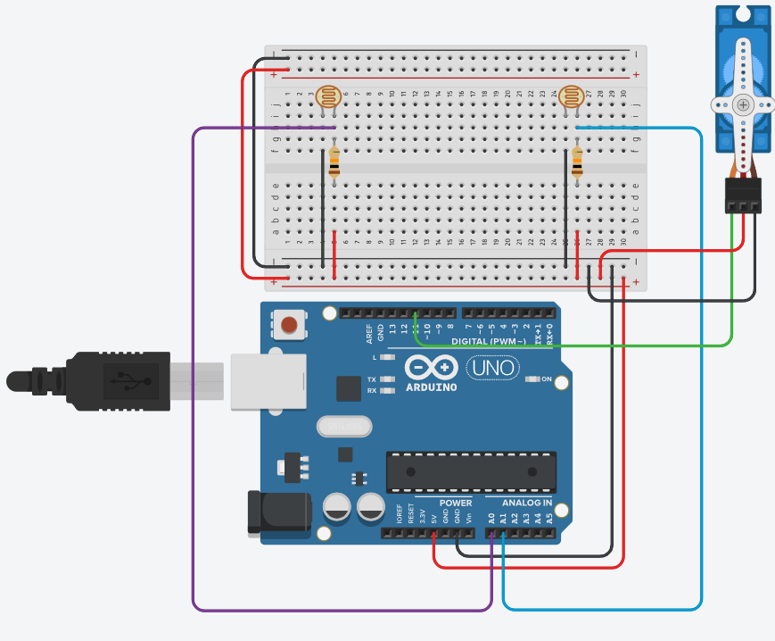
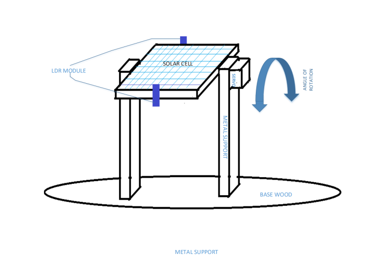
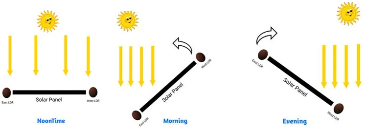

# Solar Tracking System

For this project we want to create a solar tracking system using Arduino. A solar tracking system aims to maximise the effeciency in the generation of electricity by aiming the solar panel directly at the sunlight as it moves throughout the day.

## Components
The required components for this project are

| Circuit | Base |
| :--------| :----|
| 1 x Arduino Uno | Rigifoam |
| 1 x Solar panel (or just breadboard) | Foam board |
| 1 x Servo motor | Card board |
| 2 X LDR sensor | |
| 2 x 10k resistor | |

When you start working on the tracking across multiple axes you will need a second servo motor and another couple if LDR sensors.

## Circuit

For this project you could use the following circuit. Keep in mind this circuit has the LDR directly pinned to the breadboard. For your own implementation you may or may not want to do this.

## Sensors and Servos

The LDR sensor needs to be connected to any of the analog pins. Once connected you can do the following to read it's values:

    void setup()
    {
      Serial.begin(9600);
    }

    void loop()
    {
      int ldr = analogRead(A0); // assuming it's connected to the analog pin A0

      Serial.print("LDR: ");
      Serial.println(ldr);

      delay(100); // Wait for 100 milliseconds
    }

For the servo we would need to include the `Servo.h` library and in the `setup` method attach the correct pin. Following that we can use the `write` method to move it to any degree between 0 and 180 we would like. This can be done as following:

    #include <Servo.h>

    Servo servo;

    void setup()
    {
      Serial.begin(9600);
      servo.attach(11);
      delay(1000);
    }

    void loop()
    {  
      Serial.println("Moving servo to 0..");
      servo.write(0);

      delay(2000);

      Serial.println("Moving servo to 90..");
      servo.write(90);

      delay(2000);
    }

## Solar Tracking

The aim of this project is to have a solar panel, or "solar panel", pointed in the direction of a source of light. Initially, we want to track this across a single axis. So you will need to build something along the lines of this:

Once you get that working we want to add another servo motor and a couple of sensors so we can track it another axis. This could be achieved, for example, by moving the circular base in the previous image.

A few things to consider are:

- How do we know if we are pointing directly at a source of light?
- What if one of the sensors reads more light than the other? How much difference do we care for?
- What if you don't read any, or very little, light?
- How do we prevent the motor from constantly moving or 'twitching'.
- How do we prevent the motor from moving to fast and breaking the platform it is trying to move.

> For the purposes of this task you can use your phone's torch light to act as your light source
> It may prove beneficial to add some sheets of paper between the sensors to get more accurate readings.
