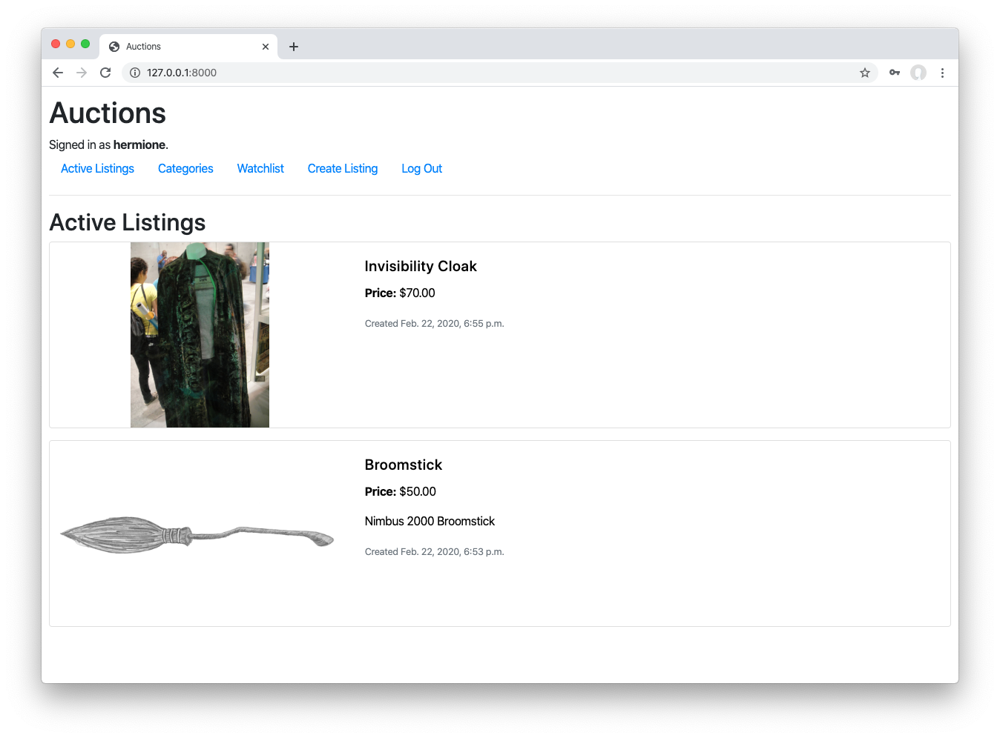
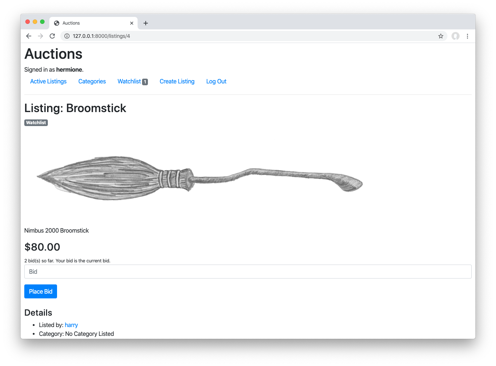

# Commerce

Design an eBay-like e-commerce auction site that will allow users to post auction listings, place bids on listings, comment on those listings, and add listings to a "watchlist."

## Getting Started

- Start your project by accepting the assignment on [GitHub Classroom](https://classroom.github.com/a/DNKi9s6K)

- Then immediately submit your repository's URL at the bottom of this page.

- Clone your new repository.

- In your terminal, `cd` into the `commerce` directory.

- Run `python manage.py makemigrations auctions` to make migrations for the `auctions` app.

- Run `python manage.py migrate` to apply migrations to your database.
