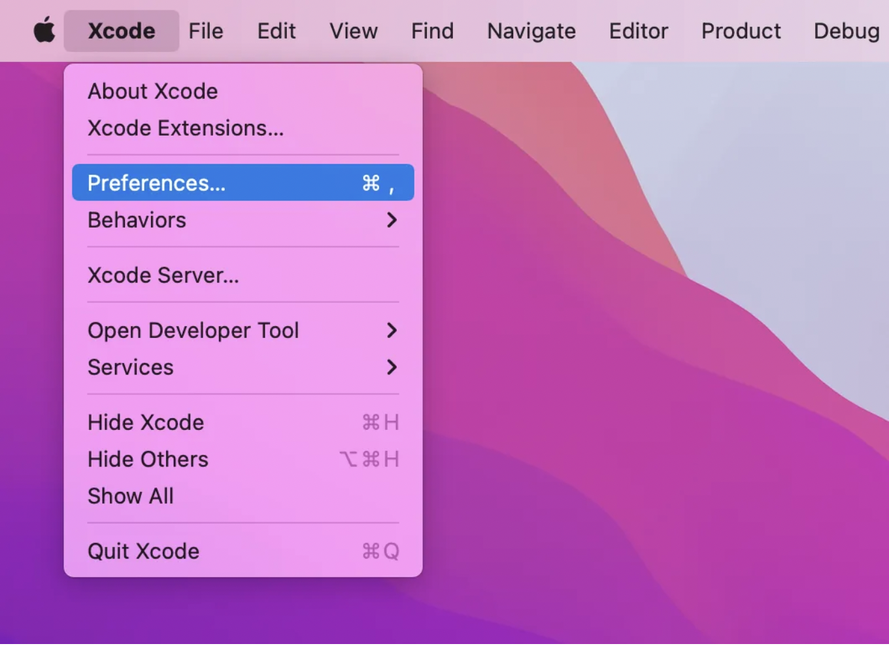
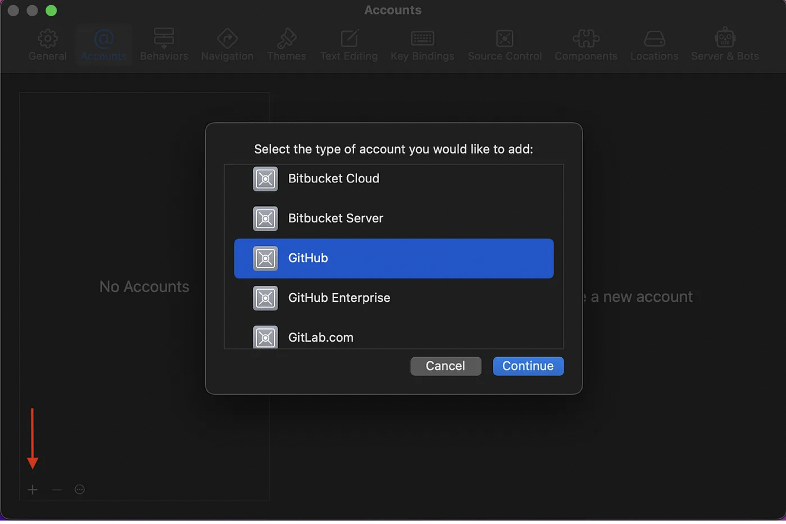
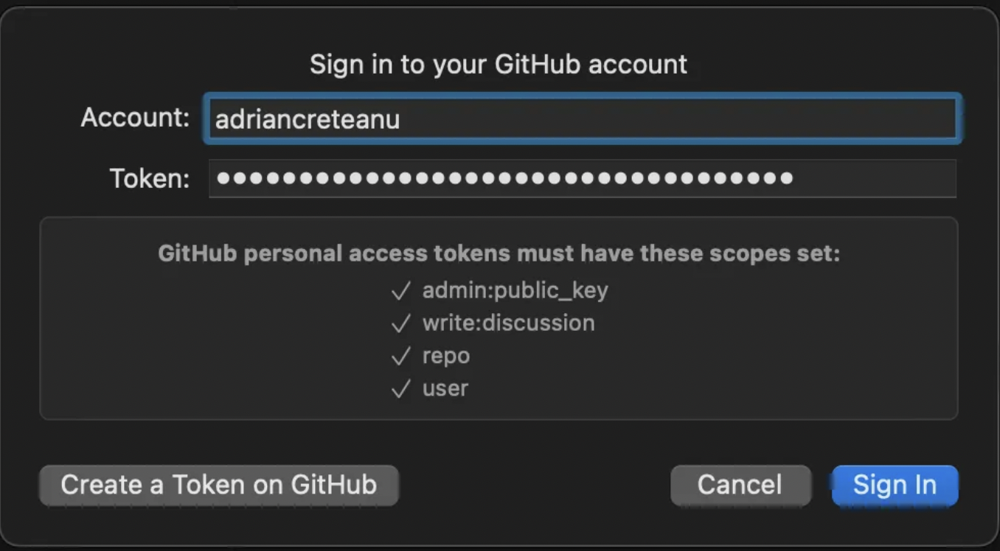

# Get set with GitHub

From now on, we will work with GitHub to keep track of changes within our project's code.

# 1. Create a GitHub account if you havent
- Create an account on [GitHub](https://github.com). You will also use it for the rest of the minor programming.

# 2. Add your GitHub account to Xcode
- Open Xcode and go to preferences

- Tap the add icon and select "GitHub" from the list

- Enter your username and the personal token. If you haven't registered to "GitHub" before, you may be asked to create a personal access token to verify your account. You can make use of the "Create a Token on GitHub" button to get redirected to GitHub. Make sure to save your personal access token somewhere on your computer (and not in a textfile within in your GitHub repository) and select all scopes.

- Now you should be able to see that your GitHub account has been added to Xcode
¡

# 3. Create Git Repository with new project
- While creating a new project, always make sure to select "Create Git repository on my Mac" 
¡

# 4. Link project to GitHub repository

- Within your project in Xcode open the "Source Control Navigator", go to repositories and right click, then click "Add Existing Remote..." 
i

- This will open a pop up window, into which you just need to paste your GitHub Repository link in the location field.
¡

Now your project should be linked to a GitHub repository.