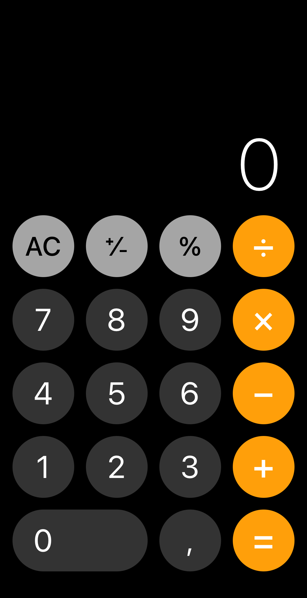

# SwiftUI Calculator

Create a single view application for a calculator using Swift and SwiftUI.

## Getting started

- Start a new Xcode SwiftUI project, while saving make sure you select _Create Git repository on My Mac_.
- Accept [this GitHub Classroom invite](https://classroom.github.com/a/S1DCgucy).
- Go to the repository and copy the link you'll see just below _Quick setup_.
- In the menu bar, click _Editor_ then _Add Existing Remote…_ and paste the link you just copied in the _Location_ field.

### Minimal functional requirements

* Support for all 10 digits.
* Support for decimal numbers through `.`.
* Support for $+$, $-$, $\times$, and $\div$.
* A reset button.
* A computation ($=$) button.
* An output screen.

### Optional features

* Viewable history of past calculations.
* The ability to re-use old results in new calculations.
* Calculations in octal and binary.
* Or something else...

### Technical requirements

* The application should run on a *single* view.
* The logic of the calculator should go in a separate `.swift` file, (probably in a `Struct` called `Calculator`).
* The application should be written in Swift and SwiftUI, no UIKit, C or Objective-C is allowed.

## Inspiration

The design of the calculator is completely up to you. However, do just take a quick look
as to what other calculators look like. Pay special attention to where buttons are
typically located and how each button behaves.

|                                     | 
| ----------------------------------- | 
|   |

Think about what [kind of calculator](https://www.rankred.com/different-types-of-calculators/) you want to implement.
Odds are, you want to implement a basic calculator, but a (simple) scientific calculator is also an option.

## Steps

### Create a view using SwiftUI
Start by creating a new SwiftUI app. Then go ahead and lay the foundations for the calculator itself. Add and arrange
all the buttons you need. And don't forget to add the display of the calculator!

### Create the calculator logic

Again, the calculator logic should go in a separate `.swift` file. Since Swift is an Object-Oriented Language odds are
you want to create a `struct` called `Calculator`, give it methods for different types of buttons.
A calculator is a stateful machine. It keeps track of past operations (button presses) and future button presses produce
different results based on past actions. That means you will need to track past actions. How you do this is up to you,
but you will likely want to introduce some attributes that store arrays or strings of sorts that keep track of the
calculation as a whole.

Once a calculation needs to be done, because, for instance, the $=$ button is pressed, start calculating.

### Add functionality to buttons

Then proceed by adding functionality to each button. All the number buttons should work somewhat the same.

Once the digit buttons are in order, open up an existing calculator and start trying out different buttons. What does
each button really do and what do you want it to do? For instance, you might have not realized, but pressing an operation
such as $+$ will clear the display or in other cases append the $+$ sign. That is something you will need to program
into your calculator.

## How to Submit

Submit your repository URL below. This should look something like: `https://github.com/minprog-platforms/your_repo_name`.