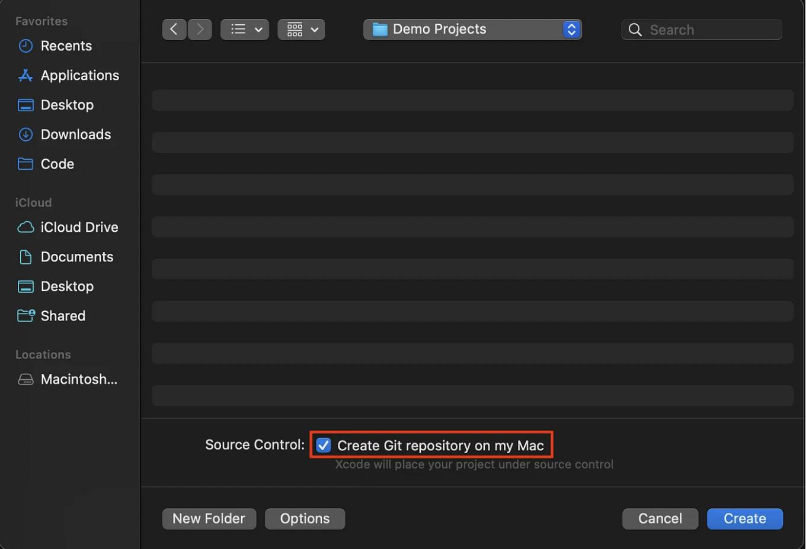
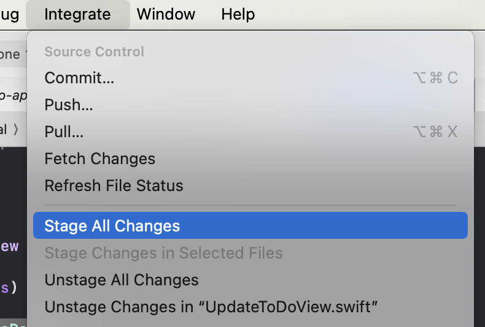
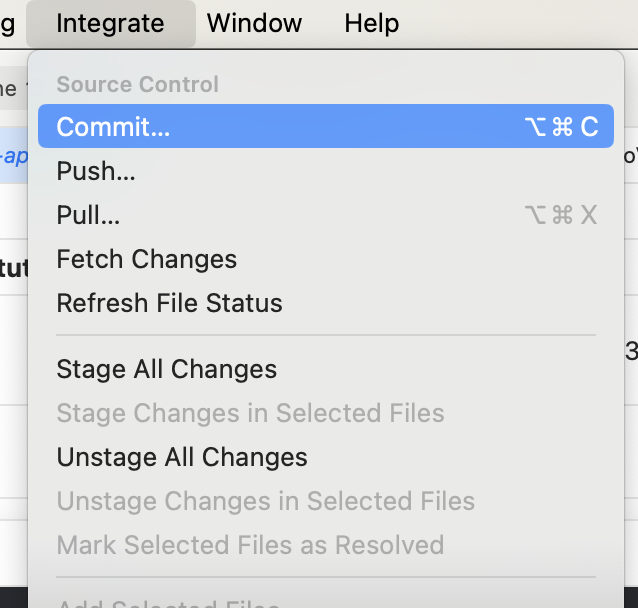
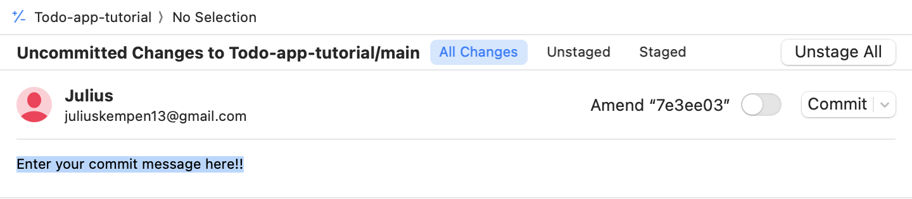
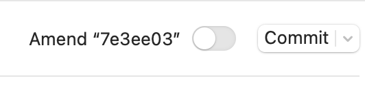

# Get set with GitHub

From now on, we will work with GitHub to keep track of changes within our project's code.

# 1. Create a GitHub account if you havent
- Create an account on [GitHub](https://github.com). You will also use it for the rest of the minor programming.

# 2. Add your GitHub account to Xcode
- Open Xcode and go to preferences

- Tap the add icon and select "GitHub" from the list

- Enter your username and the personal token. If you haven't registered to "GitHub" before, you may be asked to create a personal access token to verify your account. You can make use of the "Create a Token on GitHub" button to get redirected to GitHub. Make sure to save your personal access token somewhere on your computer (and not in a textfile within in your GitHub repository) and select all scopes.

- Now you should be able to see that your GitHub account has been added to Xcode
¡

# 3. Create Git Repository with new project
- While creating a new project, always make sure to select "Create Git repository on my Mac" 

# 4. Link project to GitHub repository

- Within your project in Xcode open the "Source Control Navigator", go to repositories and right click, then click "Add Existing Remote..." 

- This will open a pop up window, into which you just need to paste your GitHub Repository link in the location field.

Now your project should be linked to a GitHub repository. 

# 5. Keep your github repository up to date
- It is important to keep track of your progress within the github classroom, preferably (half) daily or when you finished certain milestones. You can 'stage' all the changes and additions you made to the code base through: integrate -> Stage all changes

- When you are finished editing your code and ready to update the github repository, you will first have to 'commit' to your 'staged' changes: intergrate -> Commit...

- This will open up a seperate window. It is compulsory to enter a commit message. This message should describe what kind of changes you have made to the code. 

- After you entered the message, you are ready to commit. You do so by pushing the 'commit' button.

- Your github repository is now up to date! 
