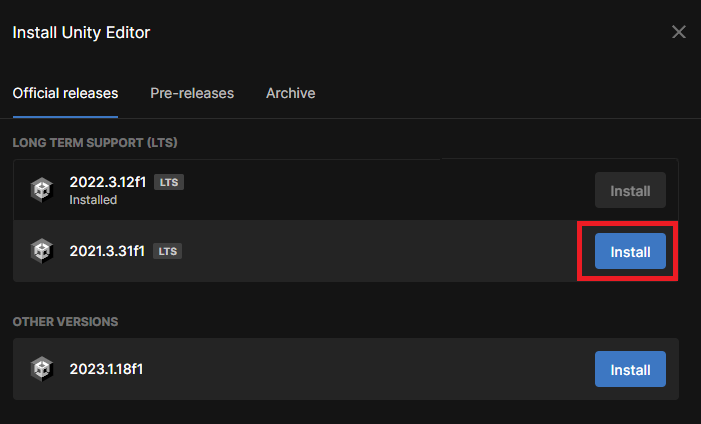
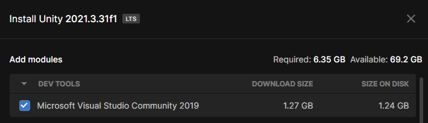

# Setup

Het is handig dat je deze setup vóór de eerste sessie hebt gedaan.

## Installatie Unity

1. Ga naar [de website van Unity](https://store.unity.com/#plans-individual) en registreer een account.
2. Vraag een 'Personal license' aan. (Een personal license is al voldoende, maar je kan er ook voor kiezen om je op te geven voor het 'Unity Student plan' om zo een gratis pro-licentie te ontvangen voor één jaar. Hiervoor moet je je uva mail gebruiken.)
   
3. Download Unity Hub.
	
4. Log in met je account en activeer je licentie. (Voor het student plan kan het zijn dat je even naar de Unity ID website moet gaan om een 'seat' toe te voegen aan je 'organisation', daar komen vervolgens de licentie keys te staan).
   
5. Download de **2021.3.3f1** LTS versie editor in Unity Hub onder Installs > Install Editor. Kies hierbij voor de modules 'Microsoft Visual Studio Community 2019' en 'Windows Build Support'. Kies ook 'Android Build Support' als je van plan bent om je eigen game te ontwikkelen voor je (Android) telefoon. (iOS heeft wat [extra vereisten nodig](https://docs.unity3d.com/Manual/UnityCloudBuildiOS.html), zoals een Mac).
    
   
   

## Je eerste project

Creëer nu je eerste project onder Projects > New Project en selecteer het **3D core** project. 

Laat het project inladen (dit kan even duren!). Wanneer het project geladen is, sluit je Unity weer af. Je gaat nu nog een project aan maken, ditmaal kies je als template één van de Learning templates. Download een template en laad het project. Vervolgens kun je weer afsluiten (of alvast zelfstandig aan de slag met het ontwikkelen van één van de Micro Games! Gebruik hiervoor de [step-by-step tutorials](https://learn.unity.com/search?k=%5B%22q%3Amicrogames%22%5D).)

## Checklist

- Unity Hub geinstalleerd
- De 2021.3.3f1 LTS versie van Unity geinstalleerd
- 3D Core project aangemaakt
- 3D Core project geopend
- Learn>MicroGame project aangemaakt
- Learn>MicroGame project geopend