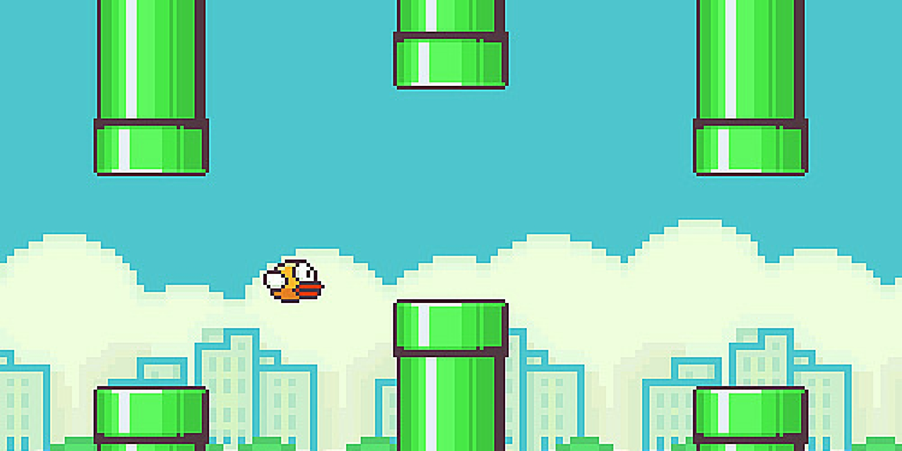

# Kennismaken met Unity

Voordat je aan de slag gaat met je eigen project, is het handig om eerst eens even goed kennis te maken met de game engine waarin je gaat werken. 

## Microgames
Nu je een klein beetje bekend bent met Unity dankzij het Roll A Ball project, ga je kijken naar één van de [Microgame projecten](https://learn.unity.com/search?k=%5B%22q%3Amicrogames%22%5D) van Unity Learn. Dit zijn templates waarin de basis van een spel al staat. Het is nu aan jou de opdracht om te begrijpen hoe deze games in elkaar steken, en met behulp van step-by-step tutorials 'mods' (modificaties) aan het spel toe te voegen. 
Terwijl je nadenkt over je project voorstel, kan je alvast aan de slag met deze Microgames. Voltooi **eerst** minstens 3 mods van één van de Microgames. 

## Flappy bird
Om verder te oefenen met Unity en vooral hoe je zelf een eigen project kan beginnen, gaan we **daarna** een zeer bekend spel namaken, namelijk [flappy bird](https://en.wikipedia.org/wiki/Flappy_Bird). In deze arcade game, uitgebracht in 2013, speel je als een vogel die vliegend, buizen moet ontwijken om zo een hoge score te halen. Aan jou nu de taak om dit in Unity te gaan namaken, wat in zowel 2D als in 3D gedaan mag worden. Bij deze keuze is het handig om rekening te houden met of je je eigen project in 2D of 3D wilt gaan maken.  

Wat willen wij zien in jou versie van flappy bird?

Minimum eisen:
- De vogel (speler) die op en neer kan bewegen.
- Buizen om te ontwijken
- Een startscherm met de titel van het spel en een startknop.
- Een verliesscherm met tekst waarop staat dat je verloren hebt, en een knop om opnieuw te beginnen.
- Er word een score bijgehouden en weergegeven.

Uitbereidingen:
- De topscore word opgeslagen
- De buizen bewegen op en neer voor extra moeilijkheid
- Er is keuze uit verschillende vogels (of andere characters)
- Pauze knop
- Andere enemy's
- Powerups
- Verzin zelf nog een leuke uitbereiding

Het doel hier is niet om jou flappy bird kopie heel mooi te gaan maken, maar om te leren omgaan met Unity. Hou het daarom voor nu **super simpel**, en ga dingen nog niet al te mooi maken! Je bent nu vooral de functionaliteiten van Unity aan het leren - je eigen game voorstel komt later pas. Geen zorgen als je nog niet super ver komt, we zijn nog aan het oefenen. Het is om deze reden dan ook toegestaan om bij deze opdracht samen te werken, dus maak daar gebruik van.

