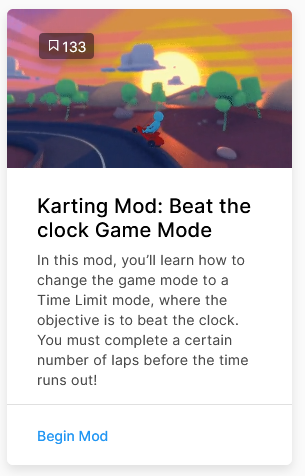

# Unity Learn

Nu je een klein beetje bekend bent met Unity dankzij het Roll A Ball project, ga je kijken naar één van de Microgame projecten van Unity Learn.

Dit zijn templates waarin de basis van een spel al staat. Het is nu aan jou de opdracht om te begrijpen hoe deze games in elkaar steken, en (met behulp van step-by-step tutorials) wat aan deze games te veranderen.

Het is de bedoeling dat je dus één van de microgame templates kiest en vervolgens de corresponderende course kiest op [deze pagina](https://learn.unity.com/course/microgames-learn-the-basics-of-unity). Kies vervolgens **minstens drie** van de 'Mods' die je het meest aanspreken. Volg de stappen in de tutorial om zo steeds iets meer te leren kennen over Unity. 

Zit je vast? Probeer dan eerst via google je eigen probleem op te lossen. Lukt het nog steeds niet? Gebruik dan het officiele Unity kanaal of onze eigen discord server om om hulp te vragen

