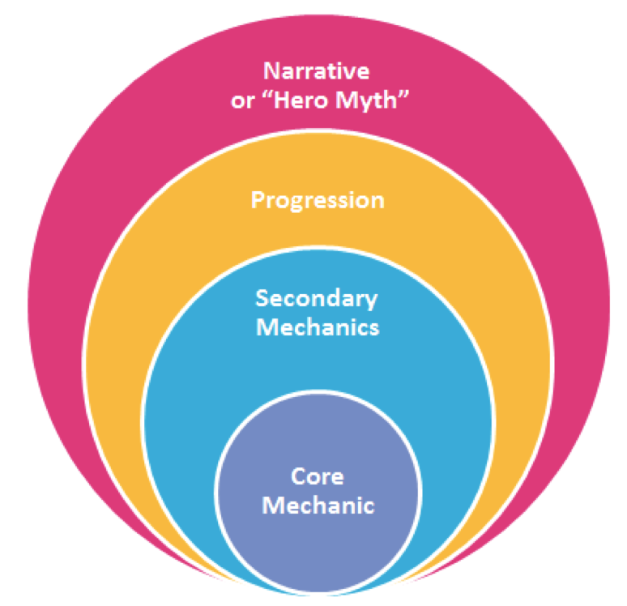

# Requirements voor een Unity-projectvoorstel

Voor de Unity track maak je straks het normale [proposal](/milestones/proposal/), maar wel met een paar Game Dev gerelateerde aanvullingen. De aanvullingen vind je op deze pagina en alle instructies voor het maken van het proposal staan op de proposal pagina.

## Een pakkende samenvatting

-   Leg kort in een korte, pakkende samenvatting de highlights van je game uit.

-   Kijk naar de store pagina's van je favoriete games om een beeld te krijgen van deze korte samenvattingen. Bijvoorbeeld: 

    *[Unrailed!](https://store.steampowered.com/app/1016920/Unrailed/) is een spel voor meerdere personen waarbij je samen met je vrienden een spoorweg door eindeloze, procedureel gegenereerde werelden aanlegt. Win de ontmoetingen met de inwoners, geef je trein een upgrade en zorg dat hij niet ontspoort.*

## Thema

Leg uit wat het thema van je spel wordt. Naast een beschrijving in tekst gebruik je hierbij een moodboard om de sfeer van je thema over te brengen op anderen. Dit moodboard hoeft geen finale versie te zijn - je kan altijd je thema altijd nog aanpassen, maar het zou wel een goede indicatie moeten zijn van welke richting je game op gaat.

## Core Mechanics Diagram

- Aan [game mechanics](https://en.wikipedia.org/wiki/Game_mechanics) is geen vaste definitie te koppelen. Één van de opties is: een game mechanic is een bepaald systeem dat de speler kan gebruiken om invloed uit te oefenen op het spel.

- Maak gebruik van een core mechanic diagram ([uitleg](https://www.jordansavant.com/book/game_theory/core_mechanic.md)) om je game concept duidelijk te maken.

- De core mechanic is er altijd maar één - hier draait je spel om. Er kunnen meerdere secondary mechanics zijn. De gele laag geeft de progressie aan, de manier waarop de speler verder komt in je spel (en reden heeft om te blijven spelen). De buitenste laag geeft het narratief aan, het verhaal en thema wat om je game heen draait.

## Scope

- Hier geef je aan waar jij het meeste focus aan wilt geven tijdens dit project. Is dat gericht op een interessante technische mechanic bedenken en implementeren, of wil je heel erg op de game design gaan zitten? Vind je het visuele design in je game belangrijk, waarbij je bijv. wilt leren 3D modellen te maken, of misschien vind je juist de netwerkcode heel interessant: Wat vind jij het belangrijkste om te bereiken gedurende dit project?

<!-- - Naast een korte beschrijving maak je ook een lijst met Must-Haves (Wat wil je dat er minstens in zit aan het einde van het project) en een lijst met Nice-To-Haves (Wat zou je er verder aan toe willen voegen als je daar tijd voor hebt?) --> 
<!-- Dit is nu ook opgenomen in het normale proposal -->

<!-- - Als laatste maak je een ruwe inschatting van hoeveel tijd aan elk onderdeel je gaat besteden. Dit is zodat je later na kan gaan wanneer je misschien te veel tijd gaat stoppen in een van je onderdelen. -->
